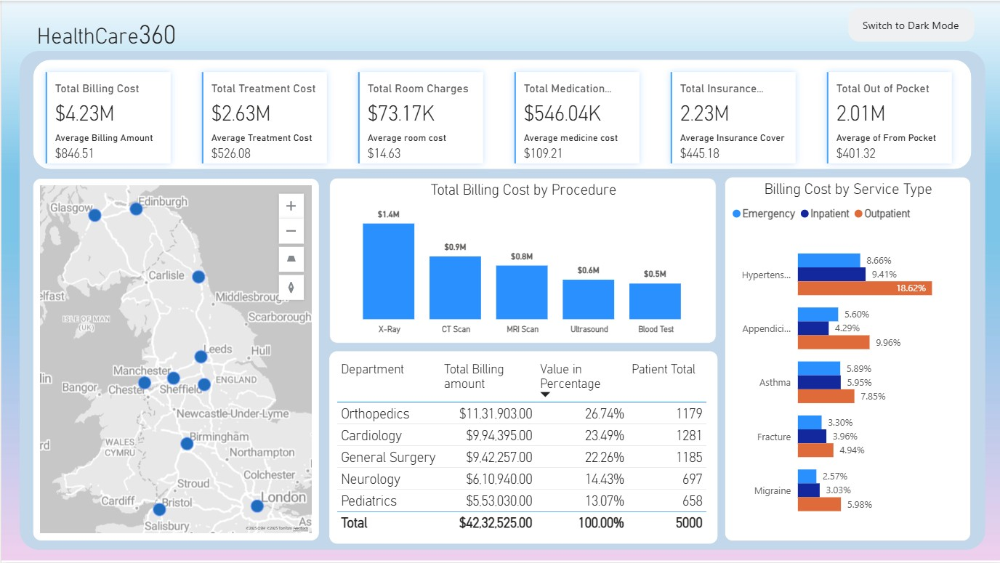

# 🏥 Healthcare360: Advanced Financial & Patient Insights Dashboard (Power BI)



## 📊 Overview

**Healthcare360** is a comprehensive Power BI dashboard built to analyze the financial performance and patient data of healthcare centers across the UK. This project leverages a real-world simulated dataset to extract actionable insights for hospital administrators, financial analysts, and healthcare decision-makers.

The dashboard features interactive visuals, trend analysis, and location-based reporting to help stakeholders better understand treatment costs, service utilization, and department-wise billing patterns.

---

## 💡 Features

- **Financial Overview**
  - Total billing, treatment, room, and medication costs
  - Average insurance and out-of-pocket expenditure

- **Procedure-Level Analysis**
  - Billing cost breakdown for major procedures (e.g., X-Ray, CT Scan, MRI)

- **Departmental Performance**
  - Department-wise billing, patient count, and percentage contribution

- **Service Type Comparison**
  - Cost comparison across Emergency, Inpatient, and Outpatient services

- **Geospatial Visualization**
  - Patient distribution and service usage mapped across the UK

- **Light & Dark Mode Views**
  - User-friendly toggle for different viewing preferences

---

## 📁 Dataset Files

The dashboard uses the following CSV files for analysis:
- `patients.csv`
- `departments.csv`
- `procedures.csv`
- `diagnoses.csv`
- `insurance.csv`
- `visits.csv`
- `providers.csv`

> **Note**: All datasets are included in the `data/` directory of this repository.

---

## 📌 Requirements

- Power BI Desktop (latest version recommended)
- Basic understanding of DAX and Power Query

---

## 🚀 Getting Started

1. Clone this repository:
   ```bash
   git clone https://github.com/your-username/healthcare360-dashboard.git

